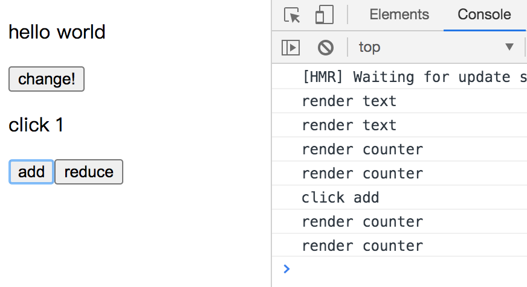

### 如何实现 React-redux

> 示例 demo：[github](https://github.com/youniaogu/simple-react-redux)
>
> 注意：为了简单明了的展示主要流程，下面示例中均会省略异常情况的处理。

#### 一、什么是 react-redux？

`react-redux`是 redux 的中间件，通过 `connect`和`Provider`这两个 api，将组件需要的状态注入进去，当 redux 里的状态发生改变时，触发相应组件的更新

#### 二、react-redux 是怎么工作的？

先看一个简单的用例

```javascript
import React from "react";
import ReactDOM from "react-dom";
import App from "./App";
import reducers from "./reducers";
import { createStore } from "redux";
import { Provider } from "react-redux";

const store = createStore(reducers);

ReactDOM.render(
  <React.StrictMode>
    <Provider store={store}>
      <App />
    </Provider>
  </React.StrictMode>,
  document.getElementById("root")
);
```

最外层`Provider`将整个应用包裹住

将`createStore`返回的`store`通过`props`传递给`Provider`

**store 并不是 redux 存储的状态**，要获得存储的状态必须通过`store.getState()`

```javascript
import React, { Component } from "react";
import { dispatchAdd, dispatchReduce } from "./actions";
import { connect } from "react-redux";

class Counter extends component {
  render() {
    return <div>{this.props.counter}</div>;
  }
}

const mapStateToProps = function(state, ownProps) {
  return {
    counter: state.counter
  };
};

const mapDispatchToProps = function(dispatch, ownProps) {
  return {
    add: dispatch(dispatchAdd),
    reduce: dispatch(dispatchReduce)
  };
};

export default connect(mapStateToProps, mapDispatchToProps)(Counter);
```

在需要 redux 的状态时，组件通过`connect`将状态传递给组件

connect 有四个传参

1. `mapStateToProps?: Function` 将 state 注入到组件中
2. `mapDispatchToProps?: Function | Object` 将 action 注入到组件中
3. `mergeProps?: Function` 在前两个传参的返回和 ownProps 作为传参，返回合并后的 props
4. `options?: Object` 自定义传入的 context ，是否是需要比较前后状态以及比较的方法，转发 ref 返回原组件还是包装后的组件

大部分情况下我们只使用到前两个方法（本文也只会讲述这两部分）

通过上面用例可以知道

- `Provider`负责传递`store`
- `connect`负责接收`store`，并将`state`注入到组件中

`Provider`是通过什么进行`store`传递？
答案是：[Context](https://reactjs.org/docs/context.html)

什么是`Context`？

简单来说，`Context`是 React 提供的一种数据传递方式，`Context`能够自动的自上而下传递数据，不需要像`props`那样手动定义传递的数据，是一个**既方便又危险**的属性。'

如果想详细了解`Context`的详细用法和说明，可以去 React 官网查看[文档](https://reactjs.org/docs/context.html)

#### 三、动手

目标：实现`connect`和`Provider`

`connect`是函数，接收`mapStateToProps`和`mapDispatchToProps`，返回[hoc](https://reactjs.org/docs/higher-order-components.html)

`Provider`是组件，接收`store`并通过`Context`传递给其他组件

```javascript
import React, { Component } from "react";
import PropTypes from "prop-types";

const StoreContext = React.createContext();

export function connect(mapStateToProps, mapDispatchToProps) {
  return function(WrappedComponent) {
    return class connect extends Component {
      render() {
        return <WrappedComponent {...this.props} />;
      }
    };
  };
}

export class Provider extends Component {
  render() {
    return (
      <StoreContext.Provider value={this.props.store}>
        {this.props.children}
      </StoreContext.Provider>
    );
  }
}

Provider.propTypes = {
  children: PropTypes.element.isRequired,
  store: PropTypes.shape({
    subscribe: PropTypes.func.isRequired,
    dispatch: PropTypes.func.isRequired,
    getState: PropTypes.func.isRequired
  })
};
```

上面就是`connect`和`Provider`最基础的定义

再来是`connect`接收`Context`，并通过传入的两个 map 方法将需要的`state`和`dispatch`注入到组件的`props`中

```javascript
...

export function connect(mapStateToProps, mapDispatchToProps) {
  return function (WrappedComponent) {
    return class connect extends Component {
      static contextType = StoreContext;

      constructor(props, context) {
        super(props, context);

        this.store = props.store || context;
      }

      render() {
        return (
          <WrappedComponent
            {...this.props}
            {...mapStateToProps(this.store.getState(), this.props)}
            {...mapDispatchToProps(this.store.dispatch, this.props)}
          />
        );
      }
    };
  };
}

...
```

到这一步，已经将`state`和`dispatch`注入到组件，但触发`action`后并不会触发组件`render`，原因在于`state`变化后并没有重新渲染组件

所以这一步我们需要监听`state`的变化，并且在确认变化后，触发组件的`render`

```javascript
...

export function connect(mapStateToProps, mapDispatchToProps) {
  return function wrapWithComponent (WrappedComponent) {
    return class Connect extends Component {
      static contextType = StoreContext;

      constructor(props, context) {
        super(props, context);

        this.store = props.store || context;
        this.state = {
          storeState: this.store.getState(),
        };
      }

      componentDidMount() {
        if (!this.unSubscribe) {
          this.unSubscribe = this.store.subscribe(
            this.handleStoreChange.bind(this)
          );
        }
      }

      componentWillUnmount() {
        if (this.unSubscribe) {
          this.unSubscribe();
        }
        this.clearCache();
      }

      handleStoreChange() {
        if (!this.unSubscribe) {
          return;
        }

        const prevStoreState = this.state.storeState;
        const storeState = this.store.getState();

        if (prevStoreState !== storeState) {
          this.setState({ storeState });
        }
      }

      clearCache() {
        this.store = null;
        this.unSubscribe = null;
      }

      render() {
        const storeState = this.state.storeState;

        return (
          <WrappedComponent
            {...this.props}
            {...mapStateToProps(storeState, this.props)}
            {...mapDispatchToProps(this.store.dispatch, this.props)}
          />
        );
      }
    };
  };
}

...
```

在订阅后，每当触发一个`action`，就会触发`handleStoreChange`方法，里面将`prevStoreState`和`storeState`进行比较，只有触发的`reducers`返回原本的`state`时才会是 true

每当`action`触发`state`变化时，每个`WrappedComponent`都会`render`，即使改变的`state`组件没有用到，所以接下来需要做一些优化

```javascript
...

  shouldComponentUpdate(prevProps, prevState) {
    return !(
      shallowEqual(this.state.storeState, prevState.storeState) ||
      shallowEqual(
        mapStateToProps(this.state.storeState, this.props),
        mapStateToProps(prevState.storeState, prevProps)
      )
    );
  }

...
```

在`shouldComponentUpdate`中，根据前后的`storeState`和`mapStateToProps`的结果来决定是否需要`render`



可以看到点击 add 按钮后，只触发了`counter`的`render`，达到了预期的效果（这里`render`两次是因为`React.StrictMode`，详细可以看[issues](https://github.com/facebook/react/issues/15074)）

到这步简易`react-redux`算是完成了

#### 思考

最后总结一下存在的一些问题：

- `mapDispatchToProps`只能传递`function`类型

  - 实际开发中大多数都会传递`action creater`而不是`action`，所以支持`object`类型是挺重要的一点

- 更新逻辑不应该在`shouldComponentUpdate`里

  - 这一点在[React Redux with Dan Abramov](https://youtu.be/VJ38wSFbM3A)视频里有提到，最初设计时更新逻辑写在`shouldComponentUpdate`里，但在特殊情况下可能会导致最后渲染出来不是最新的`state`（因为本人英语不好，没能理解错误发生的情景，所以就不写出来怕误导大家，视频内 24:59~27:30）

  - 问题的根本原因在于 react 是异步渲染，对于多个`setState`会合并成一个去执行，而 redux 修改`state`却是同步，当`dipatch`时，redux 里的`state`会立即改变，异步与同步之间的差异导致了问题

  - 讲述问题的同时也介绍了新的解决方案，将更新逻辑放在`render`里，`connect`会保留`React.createElement`生成的`element`对象，在一系列判断后返回新旧`element`对象（如果 render 里返回旧的 element 对象，将不会重新渲染）

- 更新逻辑里每个`mapStateToProps`都必须重新执行一遍

  - 当 mapStateToProps 的计算很重时，每次渲染都要话费大量时间，这是 react-redux 本身的缺陷（[reselect](https://github.com/reduxjs/reselect)解决了这个问题）

#### 参考资料

[React Redux with Dan Abramov](https://youtu.be/VJ38wSFbM3A)

[The History and Implementation of React-Redux](https://blog.isquaredsoftware.com/2018/11/react-redux-history-implementation/)
